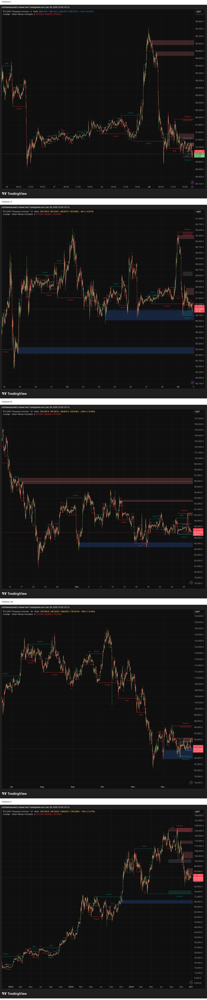
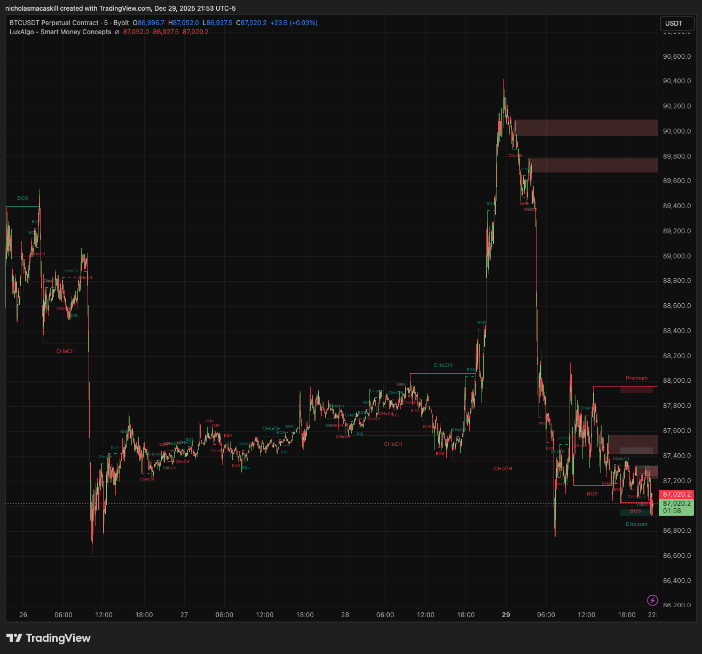
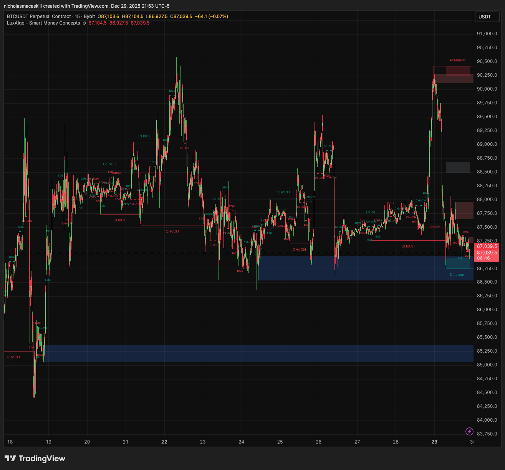
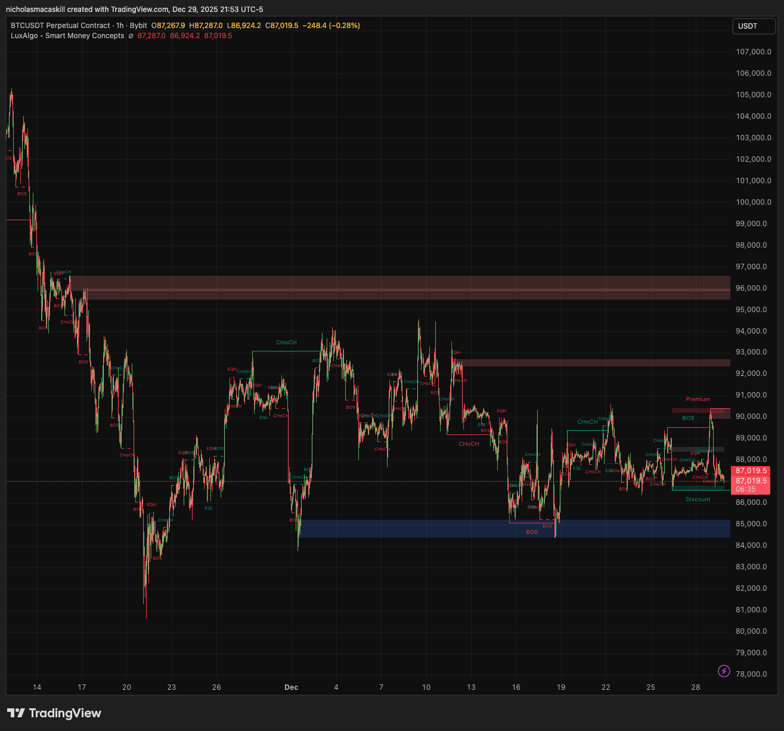
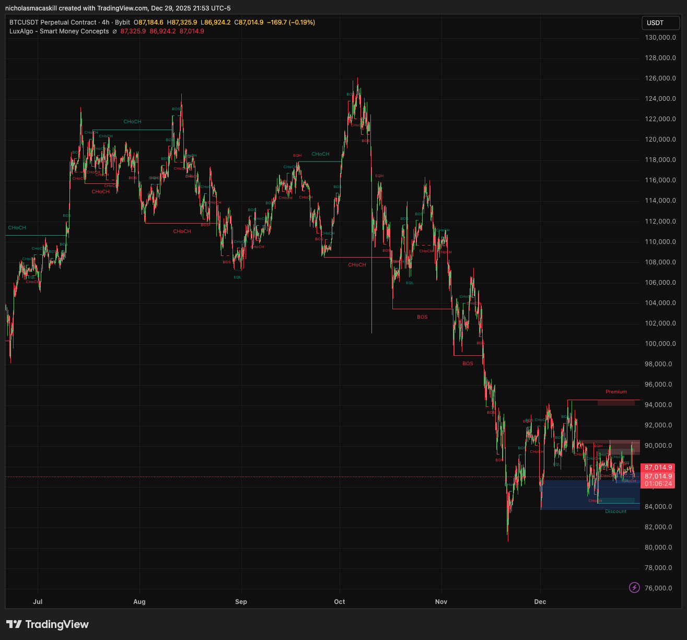
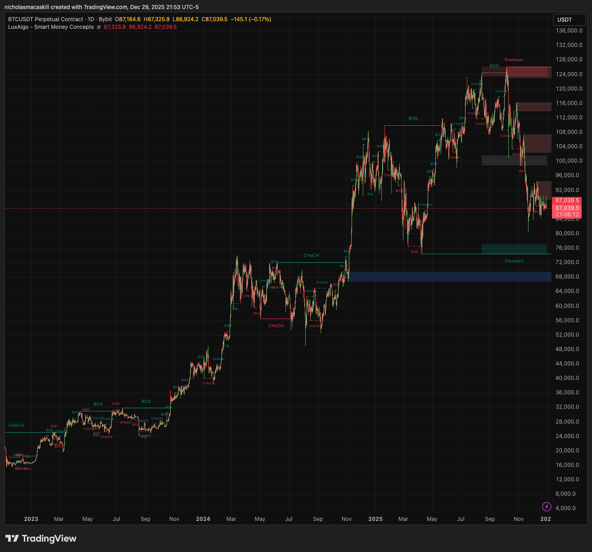

# Investment Brief: BYBIT:BTCUSDT.P
**Date**: 2025-12-29 22:54:18

## Top-Down Antigravity Analysis
**Symbol**: BTCUSDT
**Bias**: BEARISH

**Antigravity Setup Report**:
*   **HTF DOL (Daily/4h)**: The 4h chart exhibits clear bearish order flow (BOS to the downside). The market is targeting the liquidity resting below the recent major swing low, specifically the $84,000 psychological level, with a secondary target at the $82,000 demand zone.
*   **LTF Confirmation (5m/15m)**: The setup is contingent on a deeper retracement into the 4h Supply Zone. We require the 5m/15m chart to show:
    1.  **Liquidity Sweep**: Price sweeps the local high liquidity ($89,200 - $90,000).
    2.  **Market Structure Shift (MSS)**: Immediate and aggressive displacement to the downside (5m Bearish CHoCH/BOS) confirming institutional entry against the retail high sweep.
*   **Key Level Identified**: [HTF_LEVEL: 90,100.0] (Mean threshold of the 4h/15m Supply Order Block responsible for the previous aggressive push down).

**Trade Setup**:
*   **Type**: Short
*   **Entry Zone**: $89,800 – $90,200 (Entry triggered only upon 5m MSS confirmation within this zone)
*   **Stop Loss**: $90,750.0 (Placed safely above the high of the 15m supply zone)
*   **Final Target**: $84,000.0 (Primary DOL)

**Confidence**: 9
*(The score is 9 because this setup perfectly aligns the 4h bearish direction with an anticipated LTF manipulation (Sweep) and subsequent shift (MSS) at a critical HTF supply level.)*

---

## Detailed Timeframe Charts
**Grid Overview**: 

### BYBIT:BTCUSDT.P [5]

### BYBIT:BTCUSDT.P [15]

### BYBIT:BTCUSDT.P [60]

### BYBIT:BTCUSDT.P [240]

### BYBIT:BTCUSDT.P [D]

